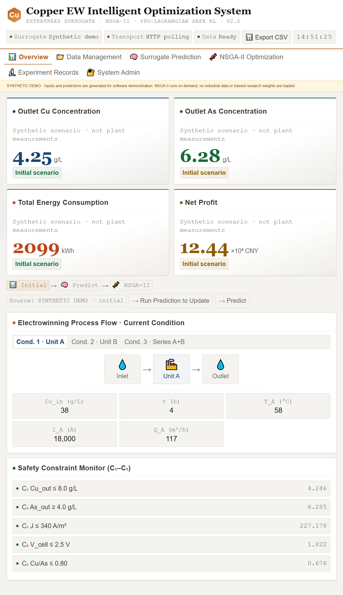
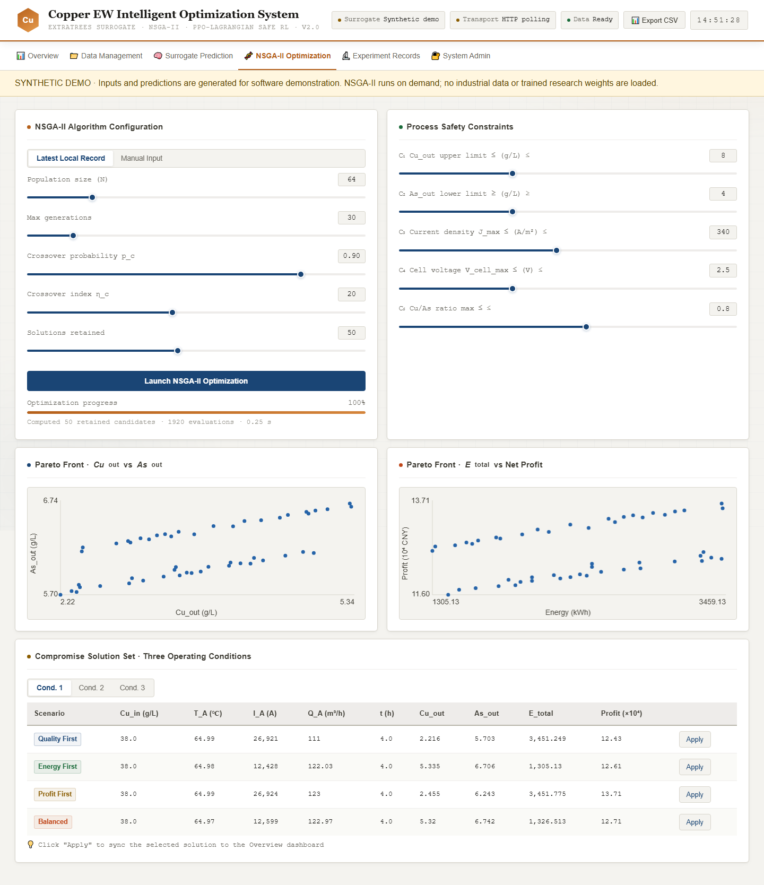
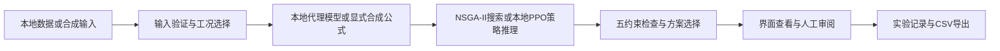

# ESRL-CMO 铜电积建模与多目标优化系统

面向铜电积过程，将工况识别、代理模型、可解释性分析、多目标优化和可视化决策支持贯通为一套研究与软件工作流。

**解决的问题**：在不同设备构型下，铜回收、砷在溶液中的保留、电力消耗和经济收益相互制约。系统把这些目标与工艺约束共同纳入计算，并呈现候选方案、约束检查和实验记录。

**技术栈**：Python、scikit-learn / ExtraTrees、SHAP / PDP、pymoo / NSGA-II、PyTorch / PPO-Lagrangian、Flask、SQLite、HTML / CSS / JavaScript。

## 先运行公开演示

公开演示使用**明确标注的合成过程公式**，无需工业数据、训练权重或模型 API 密钥。NSGA-II会实际执行搜索；预测、约束检查、耗时、方案应用、记录和CSV导出来自本次计算。

在Python 3.11的独立环境中验证过以下命令。Windows PowerShell：

```powershell
git clone --branch feature/project-release https://github.com/s1encisi/JCP.git
cd JCP
python -m venv .venv
.\.venv\Scripts\python.exe -m pip install -r requirements-demo.txt
.\.venv\Scripts\python.exe run_demo.py
```

打开 **http://127.0.0.1:5001/**。首次安装依赖后，页面运行不需要外部字体或JavaScript CDN。

Linux/macOS使用`.venv/bin/python`代替Windows解释器路径。本轮实际测试环境为Windows/Python 3.11，其他平台请运行相同测试确认。

### 两分钟操作路径

1. 在 **Data Management** 输入或导入合成记录。
2. 点击 **Predict Now**，运行预测并查看五项约束。
3. 在 **NSGA-II Optimization** 选择工况和参数，执行优化。
4. 从质量、节能、经济或均衡方案中选择一个，点击 **Apply**。
5. 回到 **Overview** 查看该方案的输入、目标和约束。
6. 在 **Experiment Records** 查看实际运行记录并下载候选解CSV。

需要导入示例时运行：

```powershell
.\.venv\Scripts\python.exe examples/create_demo_data.py
```

生成的`.runtime/synthetic_import.csv`是人工定义的演示输入，不含工厂观测。





## 研究部分与演示部分

| 内容 | 实现与边界 |
| --- | --- |
| 三种工况 | Unit A、Unit B、A+B串联；输入和模型按工况处理 |
| 代理建模 | 三工况下Cu_out、As_out和电压的九个预测任务 |
| 模型解释 | SHAP/PDP及相关分析代码；解释模型关联，不直接推断因果控制律 |
| 多目标优化 | 最小化Cu_out、最大化As_out、最小化批次电耗、最大化批次净收益 |
| 五类约束 | 出口Cu、出口As、电流密度、平均单槽电压和出口Cu/As比 |
| 安全强化学习 | 偏好条件化PPO-Lagrangian、行为克隆预训练及独立约束成本评估 |
| 公开演示 | 显式合成预测、真实NSGA-II搜索、本地界面和记录，不声称获得工业实测收益 |
| 私有研究模式 | 本地提供可信模型后进行代理预测和保存策略推理；缺少模型时明确报错 |

公开仓库不提供工业Excel、原始观测、论文材料、私有权重或企业连接信息。正式研究需要有使用权限的数据和资产，详见[运行说明](docs/RUNBOOK.md)。

## 设计特点

- **工艺相关的模型组织**：区分三类构型，使用电压到浓度的代理调用顺序，统一能耗和经济量的解释。
- **多目标与约束联合处理**：通过可行Pareto方案呈现不同运行优先级，让目标权衡可以检查和比较。
- **研究代码与界面衔接**：输入、预测、方案选择、约束和导出保持一致，保留可追溯的本地计算记录。
- **结果来源明确**：缺少模型时不生成随机预测，失败任务不显示成功，历史记录和导出文件对应实际计算。

项目的工程价值在于将成熟算法组织为适合铜电积问题的可检验工作流。性能优势需要由对应数据、划分、预算和重复实验支持。



## 目录与入口

| 路径 | 用途 |
| --- | --- |
| `run_demo.py` | 公开演示入口，监听本机127.0.0.1:5001 |
| `src/esrlcmo_project/interface/` | 页面、HTTP接口、统一工艺检查、模型调用及合成优化演示 |
| `src/esrlcmo_project/modeling/code/` | 研究建模、预处理、模型比较与解释 |
| `src/esrlcmo_project/optimization/` | NSGA-II、PPO-Lagrangian及补充算法研究 |
| `src/revision/` | 修订阶段验证与分析，运行需要对应研究资产 |
| `tests/test_workflow.py` | 约束、动作解码、API、文件保护与导出闭环测试 |
| `tools/audit_publication.py` | 暂存区与完整可达Git历史的公开检查 |
| `.runtime/` | 本地运行数据库、临时导入与导出，排除在Git之外 |

## 测试与资料

```powershell
.\.venv\Scripts\python.exe -m unittest discover -s tests -v
.\.venv\Scripts\python.exe tools/audit_publication.py
```

- [架构与关键实现](docs/ARCHITECTURE.md)
- [运行、模型接入及演示步骤](docs/RUNBOOK.md)
- [实际验证记录](docs/VALIDATION.md)
- [公开范围与保护措施](docs/PUBLICATION_AUDIT.md)
- [简历表达与面试问答](INTERVIEW_QA.md)

应用定位为本地研究和决策支持工具。Web页面不启动大规模研究训练，也不连接生产控制指令接口。生产部署、动态控制与现场收益需要独立的工程集成和现场验证。
